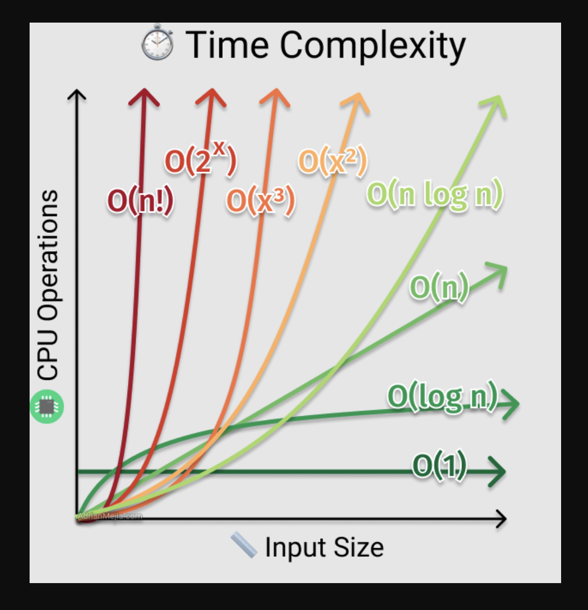

Reference:

https://medium.com/siliconwat/data-structures-in-javascript-1b9aed0ea17c

---

# Understanding Time Complexity - A cocktail party example

- O(N) – Linear
  - When you arrive at the party, you have to shake everyone's hand (do an operation on every item). As the number of attendees N increases, the time/work it will take you to shake everyone's hand increases as O(N).
  - In linear time complexity why we say O(n) ~ O(kn) ~ kO(n)
    - There's variation in the amount of time it takes to shake hands with people. You could average this out and capture it in a constant c. But the fundamental operation here --- shaking hands with everyone --- would always be proportional to O(N), no matter what c was. When debating whether we should go to a cocktail party, we're often more interested in the fact that we'll have to meet everyone than in the minute details of what those meetings look like.
- O(n^2) – Quadratic
  - The host of the cocktail party wants you to play a silly game where everyone meets everyone else. Therefore, you must meet N-1 other people and, because the next person has already met you, they must meet N-2 people, and so on.
- O(n^3) – Cubic
  - You have to meet everyone else and, during each meeting, you must talk about everyone else in the room.
- O(1) – Constant Time
  - The host wants to announce something. They ding a wineglass and speak loudly. Everyone hears them. It turns out it doesn't matter how many attendees there are, this operation always takes the same amount of time.
- O(log n) – Logarithmic Time
  - The host has laid everyone out at the table in alphabetical order. Where is Dan? You reason that he must be somewhere between Adam and Mandy (certainly not between Mandy and Zach!). Given that, is he between George and Mandy? No. He must be between Adam and Fred, and between Cindy and Fred. And so on... we can efficiently locate Dan by looking at half the set and then half of that set. Ultimately, we look at O(log_2 N) individuals.
- O(n log n)
  - You could find where to sit down at the table using the algorithm above. If a large number of people came to the table, one at a time, and all did this, that would take O(N log N) time. This turns out to be how long it takes to sort any collection of items when they must be compared.
- O(2n) – Exponential Time
- O(n!) – Factorial Time
- Best/Worst Case Time Complexity
  - You arrive at the party and need to find Inigo(name of a person) - how long will it take? It depends on when you arrive. If everyone is milling(wondering) around you've hit the worst-case: it will take O(N) time. However, if everyone is sitting down at the table, it will take only O(log N) time. Or maybe you can leverage the host's wineglass-shouting power and it will take only O(1) time.Assuming the host is unavailable, we can say that the Inigo-finding algorithm has a lower-bound of O(log N) and an upper-bound of O(N), depending on the state of the party when you arrive.
- 

---
